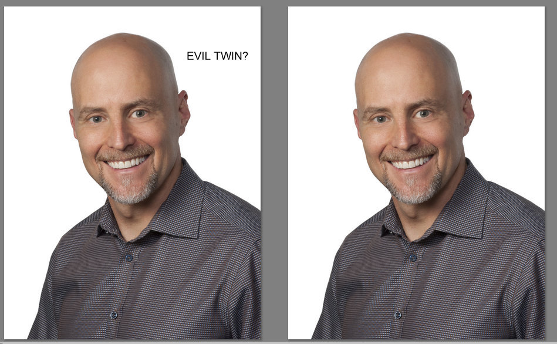
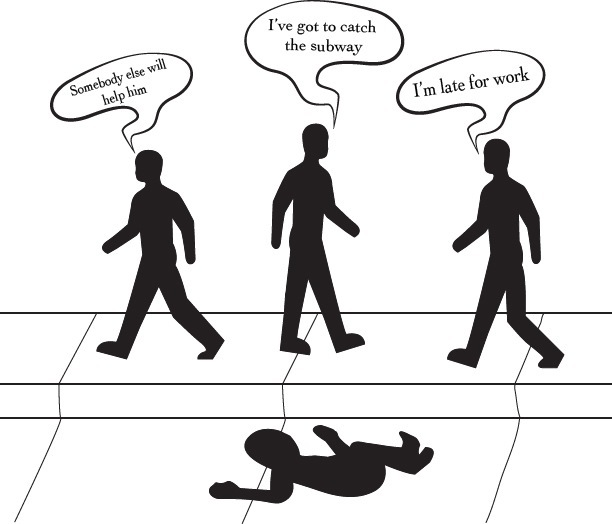
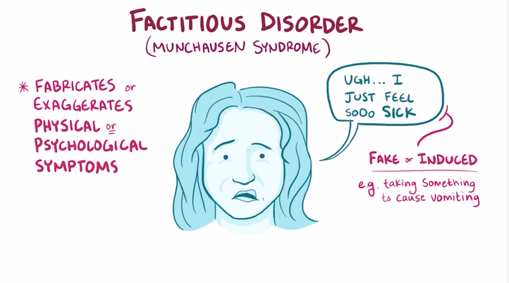
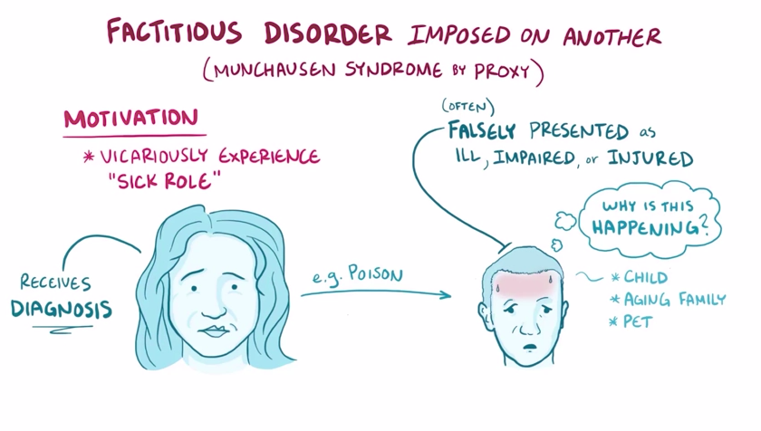

# Awesome Social Science 

> A curated list of adages, psychological syndromes and behaviour explaining aphorisms.

Inspired by this [issue](https://github.com/sindresorhus/awesome/issues/229) and the [awesome](https://github.com/sindresorhus/awesome) list thing.

Please read the [Contributing Guidelines](./contributing.md) before contributing.

## Table of Contents

- [Aphorisms / Adages / Epigrams](#aphorisms--adages--epigrams)
  - [Occam's Razor](#occams-razor)
  - [Hanlon's Razor](#hanlons-razor)
  - [Murphy's Law](#murphys-law)
  - [Godwin's Law](#godwins-law)
  - [Parkinson's Law](#parkinsons-law)
- [Psychological Syndromes](#psychological-syndromes)
  - [Stockholm Syndrome](#stockholm-syndrome)
  - [Dunning-Kruger Effect](#dunning-kruger-effect-dke)
  - [Pygmalion Effect](#pygmalion-effect)
  - [Golem Effect](#golem-effect)
  - [Capgras Syndrome](#capgras-syndrome)
  - [Hawthorne Effect](#hawthorne-effect)
  - [Fregoli Delusion](#fregoli-delusion)
  - [Placebo Effect](#placebo-effect)
  - [Synesthesia](#synesthesia)
  - [Bystander Effect](#bystander-effect)
  - [Munchausen syndrome](#munchausen-syndrome)
  - [Munchausen syndrome by proxy](#munchausen-syndrome-by-proxy)
  - [Zeigarnik Effect](#zeigarnik-effect)
  - [Mere-exposure Effect](#mere-exposure-effect)
  - [Cotard Delusion](#cotard-delusion)
  - [Trichotillomania](#trichotillomania)
  - [Schizophrenia](#schizophrenia)
  - [Borderline Personality Disorder](#borderline-personality-disorder-bpd)
  - [Prosopagnosia](#prosopagnosia)
  - [Body Dysmorphic Disorder](#body-dysmorphic-disorder)
  - [Ganser syndrome](#ganser-syndrome)
  - [Acute Stress Disorder](#acute-stress-disorder)
  - [Hypochondria](#hypochondria)
  - [Attention Deficit Hyperactivity Disorder](#attention-deficit-hyperactivity-disorder-adhd)
  - [Autism Spectrum Disorder](#autism-spectrum-disorder-asd)
  - [Post Traumatic Stress Disorder](#post-traumatic-stress-disorder-ptsd)

## Aphorisms / Adages / Epigrams

#### [Occam's Razor](https://en.wikipedia.org/wiki/Occam%27s_razor)

> Among competing hypotheses that predict equally well, the one with the fewest assumptions should be selected

For each accepted explanation of a phenomenon, there is always an infinite number
of possible and more complex alternatives, but simpler theories are more preferable
because they are easily testable. This is a line of reasoning often used in daily life.

[R: ucr.edu](http://math.ucr.edu/home/baez/physics/General/occam.html)

[R: howstuffworks.com](http://science.howstuffworks.com/innovation/scientific-experiments/occams-razor.htm)

#### [Hanlon's Razor](https://en.wikipedia.org/wiki/Hanlon%27s_razor)

> Never attribute to malice that which can be adequately explained by stupidity.

A special case of Occam's razor, the history of this aphorism is controversial,
but the applications are endless. [Miscommunications are often attributed](https://github.com/sindresorhus/ama/issues/48#issuecomment-118540912)
to this aphorism in Open Source Projects.

[R: jargon, node](http://www.jargon.net/jargonfile/h/HanlonsRazor.html)

[R: rationalwiki.org](http://rationalwiki.org/wiki/Hanlon's_razor)

#### [Murphy's Law](https://en.wikipedia.org/wiki/Murphy%27s_law)

> If anything can go wrong -- it will.

People most often relate with `If there is a worse time for something to go wrong,
it will happen then.`, especially after the dawn of mobile communication (no coverage
right when you need it most) and the Internet (no connectivity, when you have to send
that one life-changing email.)

[R: Ultimate collections of Murphy's Laws](http://murphyslaws.net/)

#### [Godwin's Law](https://en.wikipedia.org/wiki/Godwin's_law)

> As an online discussion grows longer, the probability of a comparison involving Nazis or Hitler approaches 1

In many newsgroups, it is a tradition in which whoever mentions the Nazis automatically
loses the debate that was going on, and the thread is finished there and then. Also, popularly
referred to as `Playing the Hitler card`.

> It was difficult, after attempting a greater psychological understanding of why the Holocaust
> happened and how it was conducted, to tolerate the glib comparisons I encountered on the Internet
> (Usenet in those days) - Mike Godwin

[R: Mike Godwin on 18 years of Godwin's law](http://jewcy.com/jewish-arts-and-culture/i_seem_be_verb_18_years_godwins_law)

[R: slashdot.com, history and popular use](http://knowyourmeme.com/memes/godwins-law)

[Bonus: an xkcd about this as well!](https://xkcd.com/261/)

***

#### [Parkinson's law](https://en.wikipedia.org/wiki/Parkinson%27s_law)

>  Work expands so as to fill the time available for its completion. 

This adage explains why you end up studying the majority of your syllabus one
day before the exam  despite the fact that you probably had over a week to
study. Interestingly, it is used to   explain the inefficiencies of bureaucratic
systems. Having earlier deadlines can be a way to get   around the problem.

[R: A Beginners Guide To Parkinson’s Law: How To Do More Stuff By Giving Yourself Less Time](https://impossiblehq.com/parkinsons-law/)

[R: What is Parkinson's law: The Hindu](http://www.thehindu.com/opinion/op-ed/what-is-parkinsons-law-in-management/article19758089.ece)

## Psychological Syndromes

#### [Stockholm Syndrome](https://en.wikipedia.org/wiki/Stockholm_syndrome)

> When the victim mistakes a lack of abuse as an act of kindness by the captor.

Traumatic bonding that is most common in kidnapping situations, where the hostages
express sympathy towards the captor, to the point of defending the captors. It may be
attributed to the natural selection process that let our hunter-gatherer ancestors
solve adaptive problems.

[R: bbc.com](http://www.bbc.com/news/magazine-22447726)

[Origin: Norrmalmstorg robbery
](https://en.wikipedia.org/wiki/Norrmalmstorg_robbery)

[R: Societal Stockholm Syndrom](http://web2.iadfw.net/ktrig246/out_of_cave/sss.html)

[R: howstuffworks.com](http://health.howstuffworks.com/mental-health/mental-disorders/stockholm-syndrome.htm)

#### [Dunning-Kruger effect](https://en.wikipedia.org/wiki/Dunning%E2%80%93Kruger_effect) [DKE]

> When unskilled individuals mistakenly assess their abilty to be much higher than is accurate

[R: Dunning Kruger effect in Software Development](http://www.iainjmitchell.com/blog/dunning-kruger/)

[R: Lessons learnt](http://theness.com/neurologicablog/index.php/lessons-from-dunning-kruger/)

[R: What DKE is and isn't](http://www.talyarkoni.org/blog/2010/07/07/what-the-dunning-kruger-effect-is-and-isnt/)

#### [Pygmalion effect](https://en.wikipedia.org/wiki/Pygmalion_effect)

> the phenomenon whereby higher expectations lead to an increase in performance

The idea behind this effect is that if a leader expects more of a follower, then the follower tends to
improve their performance. Studies of this effect in action are hard to conduct because they are generally
in an artificial, manipulated setting. Also, there is an argument that often the perception of a follower
by the leader directly or indirectly affect the expectations that said leader has from the follower. This
effect was shown to exist in schools in the Rosenthal-Jacobson study.

[R: hbr.org](https://hbr.org/2003/01/pygmalion-in-management)

[R: krauthammer.com](http://www.krauthammer.com/articles/the-pygmalion-effect)

#### [Golem Effect](https://en.wikipedia.org/wiki/Golem_effect)

> The phenomenon where lower expectations placed upon individuals leads to poorer performance

The Golem effect is the negative corrollary of the Pygmalion Effect: Supervisors
with negative expectations will inadvertently produce behaviours that reduce the
efficiency of their subordinates. This effect has been most rigorously studied
in Classroom settings. Teachers treat students performing poorly with high
negative bias, this in turn leads the students to perform poorly, reinforcing
the teacher's belief. This is one of the most problematic consequences of Golem
Effect in the Classroom. A few studies have also been made on the Golem effect
in the workplace.

[R:
buzzle.com](http://www.buzzle.com/articles/psychology-behind-the-golem-effect.html)

[R: Seimnal 1982 Paper on Golem
Effect](http://psycnet.apa.org/journals/edu/74/4/459.pdf)

#### [Capgras Syndrome](https://en.wikipedia.org/wiki/Capgras_delusion)

> Delusion that an individual's closed ones have been replaced by a double.

Capgras Syndrome(a.k.a Capgras Delusion) is a psychiatric disorder in which a
person holds a delusion that a friend, spouse, parent, or other close family
member (or pet) has been replaced by an identical impostor. There is no
definitive diagnosis available.

[R:healthline.com](https://www.healthline.com/health/capgras-syndrome)

[R:psychnet-uk.com](http://www.psychnet-uk.com/x_new_site/DSM_IV/capgras_syndrome.html)

#### [Hawthorne Effect](https://en.wikipedia.org/wiki/Hawthorne_effect)

> People behave better or improve their productivity when under observation

The Hawthorne effect (a.k.a Observation Bias) was first noticed at Hawthorne
Works in Cicero, IL where the correlation between lighting conditions and
employee producitivty was studied. Critics who doubt that a correlation exists
in reality argue that the Hawthorne effect is a variant of the demand effect.
Richard Nisbett, a distinguished professor of social psychology, has described
the Hawthorne effect as "a glorified anecdote", saying that "once you have got
the anecdote, you can throw away the data."

[R: explorable.com](https://explorable.com/hawthorne-effect)

[R: verywell.com](https://www.verywell.com/what-is-the-hawthorne-effect-2795234)

#### [Fregoli Delusion](https://en.wikipedia.org/wiki/Fregoli_delusion)

> Belief that different people are in fact the same!

It is a rare disorder in which a person holds a delusional belief that different
people are in fact a single person who changes appearance or is in disguise!
The syndrome may be related to a brain lesion and is often of a paranoid nature,
with the delusional person believing themselves persecuted by the person they
believe is in disguise. This delusion is related to [Capgras
delusion](#capgras-syndrome).  Psychiatrists believe it is the result of
troubles with facial perception, which can be caused by traumatic brain injury.

[R: delusionaldisorders.wordpress.com](https://delusionaldisorders.wordpress.com/2013/11/04/what-is-fregoli-delusion/)

[R: glennmillermd.com](http://glennmillermd.com/the-fregoli-delusion/)

#### [Placebo Effect](https://en.wikipedia.org/wiki/Placebo)

> Belief in a treatment may be enough to change the course of a person's physical illness.

A placebo is a substance or treatment with no active therapeutic effect. A
placebo may be given to a person in order to deceive the recipient into thinking
that it is an active treatment. In drug testing and medical research, a placebo
can be made to resemble an active medication or therapy so that it functions as
a control; this is to prevent the recipient(s) and/or others from knowing
whether a treatment is active or inactive, as expectations about efficacy can
influence results. In a broad sense, the effect may be viewed as an improvement
in patients' symptoms that are attributable to their participation in the
therapeutic encounter, with it's rituals, symbols, and interactions.

[R: Placebo Effects in Medicine](http://www.nejm.org/doi/full/10.1056/NEJMp1504023)

[R: betterhealth.vic.gov.au](https://www.betterhealth.vic.gov.au/health/conditionsandtreatments/placebo-effect)

#### [Synesthesia](https://en.wikipedia.org/wiki/Synesthesia)

> When stimulation of one sense leads to involuntary experiences in another sense

This neurological phenomenon occurs when stimulation of one sense leads to
involuntary experiences in another sense or a "union of the senses" where for
example taste and sound are joined together.  Some people experience color when
they hear sounds or read words and may be able to answer a question like "What
color is A?" Over 60 types of Synesthesia have been reported. Approximately 1 in
2000 people are believed to have Synesthesia.

[R: scientificamerican.com](https://www.scientificamerican.com/article/what-is-synesthesia)

[R: apa.org](https://www.apa.org/monitor/mar01/synesthesia.aspx)

#### [Bystander Effect](https://en.wikipedia.org/wiki/Bystander_effect)

> Phenomenon in which individuals are less likely to offer help to a victim when
> other people are present

This effect occurs when the presence of others discourages an individual from
intervening in an emergency situation. When an emergency situation occurs,
observers are more likely to take action if there are few or no other witnesses.
Being part of a large crowd makes it so no single person has to take
responsibility for an action. Knowing that the bystander effect exists
consciously is thought to be enough to prevent it from happening when one is a
bystander in a situation where a victim needs help. If you are the victim
seeking help, singling out one person in the crowd and appealing to them for
help is often recommended as the best strategy to get any required assistance.

[R :verywell.com](https://www.verywell.com/the-bystander-effect-2795899)

[R :thehindu.com](http://www.thehindu.com/opinion/op-ed/bystander-effect-psychology/article17545542.ece)

#### [Munchausen syndrome](https://en.wikipedia.org/wiki/Factitious_disorder_imposed_on_self)

> Person pretends to have a physical or mental illness in an attempt to get
> seek attention

Munchausen's syndrome is a psychological and behavioural condition where someone
pretends to be ill or induces symptoms of illness in themselves. Their main
intention is to assume the "sick role" to have people care for them and be the
centre of attention. People with this disorder are often willing to undergo
painful and risky tests in order to get the sympathy and special attention given
to people who are truly ill. People suffering from this syndrome suffer from
severe emotional difficulties.

[R: nhs.uk](https://www.nhs.uk/conditions/munchausens-syndrome/)

[R: my.clevelandclinic.org](https://my.clevelandclinic.org/health/articles/munchausen-syndrome)

#### [Munchausen syndrome by proxy](https://en.wikipedia.org/wiki/Factitious_disorder_imposed_on_another)

> Person acts as if an individual he or she is caring for has an illness when
> the person is not really sick.

Munchausen by proxy syndrome is a relatively rare form of child abuse that
involves the exaggeration or fabrication of illnesses or symptoms by a primary
caretaker. The adult perpetrator lies about illness in another person under his
or her care, usually a child under 6 years of age. The female antagonist of the
book [Sharp Objects by Gillian
Flynn](https://www.goodreads.com/book/show/18045891-sharp-objects) suffered from
this disorder.

[R: healthline.com](https://www.healthline.com/health/munchausen-syndrome-by-proxy)

[R: medicinet.com](https://www.medicinenet.com/munchausen_syndrome_by_proxy/article.htm)

#### [Zeigarnik Effect](https://en.wikipedia.org/wiki/Zeigarnik_effect)

> People remember uncompleted or interrupted tasks better than completed ones!

Psychologist Bluma Zeigarnik observed the effect of interruption on memory
processing in 1927. Whilst studying at the University of Berlin, her professor,
Kurt Lewin, had noted how waiters in a cafe seemed to remember incomplete tabs
more efficiently than those that had been paid for and were complete.  Zeigarnik
decided to test this hypothesis in an experimental setting, and published her
findings in On Finished and Unfinished Tasks, 1927.  Zeigarnik’s initial
findings revealed that participants were able to recall details of interrupted
tasks around 90% better than those that they had been able to complete
undisturbed.

[R: spring.org.uk](http://www.spring.org.uk/2011/02/the-zeigarnik-effect.php)

[R: goodtherapy.org](https://www.goodtherapy.org/blog/psychpedia/zeigarnik-effect)

[On Finished and Unfinished Tasks (Bluma Zeigarnik, 1927)](http://archive.is/rZC00)

#### [Mere-exposure Effect](https://en.wikipedia.org/wiki/Mere-exposure_effect)
 
> Repeated exposure of something leads to a more positive feeling about it

The mere-exposure effect is a psychological phenomenon by which people tend to
develop a preference for things merely because they are familiar with them. In
social psychology, this effect is sometimes called the familiarity principle. In
studies of interpersonal attraction, the more often a person is seen by someone,
the more pleasing and likeable that person appears to be. Another application is
in seen in concerts where the crowd is more excited to listen to the cover of a
popular song or an older song of the performing artist, as compared to a new,
unheard one. Yet another application is related to advertising, where customers
are more likely to buy a product that they have seen advertised several times
before as compared to a product that they haven't ever seen before.

[R: socialpsychonline.com](http://socialpsychonline.com/2016/03/the-mere-exposure-effect/)

[R: psychologytoday.com](https://www.psychologytoday.com/blog/ulterior-motives/200811/know-me-is-me-i-mere-exposure)

#### [Cotard Delusion](https://en.wikipedia.org/wiki/Cotard_delusion)

> A rare mental disorder where the patient thinks they are dead or are missing some organs.

This delusion, a.k.a the Walking Corpse Syndrome, is a rare mental disorder in
which a person mistakenly believes that they are dead, do not exist or are
putrefying.  Patients claim that they do not have internal organs or blood. The
illness can be simply described as the denial of self-existence. Some patients
may have delusions of immortality. The Cotard delusion withdraws the afflicted
person from other people due to the neglect of their personal hygiene and
physical health. The delusion of negation of self prevents the patient from
making sense of external reality, which then produces a distorted view of the
external world.

[R: thesun.co.uk](https://www.thesun.co.uk/living/2303771/what-is-cotards-delusion-what-are-the-symptoms-and-why-is-it-called-walking-corpse-syndrome/)

[R: medigoo.com](https://www.medigoo.com/articles/cotards-delusion/)

#### [Trichotillomania](https://en.wikipedia.org/wiki/Trichotillomania)

> This disorder causes an urge in patient to pull their hair out

It is often caused by post-traumatic stress disorder or obsessive-compulsive
disorder. A study has identified some gene mutations that increase the
vulnerabilities. Treatment includes Habit Reversal Training where the patient is
trained to recognize this abnormal impulse. The condition may also occur in
early childhood.

[R: National Health Service ](https://www.nhs.uk/conditions/trichotillomania/)

[R: Kid's Health](http://kidshealth.org/en/teens/trichotillomania.html)

#### [Schizophrenia](https://en.wikipedia.org/wiki/Schizophrenia)

> Psychological disorder characterized by symptoms of lack of contact with reality

It was coined in 1910 by the Swiss psychiatrist Paul Eugen Bleuler derived from
the Greek words schizo (split) and phren (mind). An illness closely resembling
schizophrenia can be found in an ancient Egyptian medical text, dating back to
1550 BC. It causes a disconnection between what a person perceives as reality
and what truly is reality. This mental gap can be extremely confusing,
upsetting, and causes intense psychological distress to the patient.

[R: nihm.gov](https://www.nimh.nih.gov/health/topics/schizophrenia/index.shtml)

[R: rethink.org](https://www.rethink.org/diagnosis-treatment/conditions/schizophrenia)

[R: mentalhealthamerica.net](http://www.mentalhealthamerica.net/conditions/schizophrenia)

#### [Borderline Personality Disorder](https://en.wikipedia.org/wiki/Borderline_personality_disorder) [BPD]

> Long pattern of abnormal behaviour including varying moods and self-image

People suffering from this disorder can experience anger, depression and anxiety
which may last from a few hours to days. People may experience unstable
relationships, indulge in risky activities, isolate themselves, feel
diassociation or engage in self-harming behaviours. The cause for BPD is
unknown. Although, studies show that many individuals with BPD report abuse,
neglect and separation as young children. This syndrome can be treated using
techniques such as Dialectical Behaviour Therapy and Cognitive Behaviour
Therapy.

[R: National Institute of Mental Health](https://www.nimh.nih.gov/health/topics/borderline-personality-disorder/index.shtml)

[R: psycom.net](https://www.psycom.net/depression.central.borderline.html)

#### [Prosopagnosia](https://en.wikipedia.org/wiki/Prosopagnosia)

> A cognitive disorder that impairs the patient's recognition of familiar faces

This disorder is caused by lesions in the brain's occipital areas or due to
Alzheimer's disease. People suffering from this disorder can still differentiate
between people based on their hairstyle, their gait or their voice, but even
these strategies don't always work, especially when meeting people out of
context. There have been no treatment methods discovered as of now.

[R: National Health Service](https://www.nhs.uk/conditions/face-blindness/)

[R: National Institute of Neurological Disorders and Stroke](https://www.ninds.nih.gov/Disorders/All-Disorders/Prosopagnosia-Information-Page) 

#### [Body Dysmorphic Disorder](https://en.wikipedia.org/wiki/Body_dysmorphic_disorder)

> A mental illness involving obsessive focus on a perceived flaw in appearance

Body dysmorphic disorder (BDD) is a mental disorder characterized by the 
obsessive idea that some aspect of one's own appearance is severely flawed 
and warrants exceptional measures to hide or fix it. In BDD's delusional 
variant, the flaw is imagined. If the flaw is actual, its importance is severely 
exaggerated.

[R: adaa.org](https://adaa.org/understanding-anxiety/related-illnesses/other-related-conditions/body-dysmorphic-disorder-bdd)

[R: nhs.uk](https://www.nhs.uk/conditions/body-dysmorphia/)

#### [Ganser syndrome](https://en.wikipedia.org/wiki/Ganser_syndrome)

> Patient responds to questions with an incorrect answer

Ganser syndrome is a rare dissociative disorder previously classified as a 
factitious disorder. It is characterized by nonsensical or wrong answers to
questions or doing things incorrectly, other dissociative symptoms such as fugue, 
amnesia or conversion disorder, often with visual pseudohallucinations and a 
decreased state of consciousness. This syndrome is still shrouded in mystery,
owing mainly to the difficulty in conducting objective research. A patient might
deliberately give odd approximate answers to a series of questions in an effort
to confuse researchers.

[R: emedicine.medscape.com](https://emedicine.medscape.com/article/287390-overview)

[R: minddisorders.com](http://www.minddisorders.com/Flu-Inv/Ganser-s-syndrome.html)

#### [Acute Stress Disorder](https://en.wikipedia.org/wiki/Acute_stress_reaction)

> As a response to the traumatic event, the individual develops dissociative symptoms

Acute stress reaction (also called acute stress disorder, psychological shock, 
mental shock, or simply shock) is a psychological condition arising in response 
to a terrifying or traumatic event, or witnessing a traumatic event that induces 
a strong emotional response within the individual. It should not be confused with
the unrelated circulatory condition of shock/hypoperfusion. 

[R: psychologytoday.com](https://www.psychologytoday.com/conditions/acute-stress-disorder)

[R: healthline.com](https://www.healthline.com/health/acute-stress-disorder)

#### [Hypochondria](https://en.wikipedia.org/wiki/Hypochondriasis)

> Obsession with the idea of having a serious but undiagnosed medical condition

Hypochondriasis or hypochondria is a condition in which a person is inordinately
worried about having a serious illness.  It has been claimed that this
debilitating condition results from an inaccurate perception of the condition of
body or mind despite the absence of an actual medical diagnosis. Hypochondriacs
demand more tests at a time when physicians are under pressure to curtail
unnecessary procedures -- and they move among multiple providers, making it
difficult to manage their care. As a group, hypochondriacs cost billions of
dollars a year in unnecessary medical tests and treatments that are many times
not borne by the individual, but by all the people whose insurance premiums rise
because of these bills.

[R: psychologytoday.com](https://www.psychologytoday.com/blog/life-after-50/201703/hypochondria)

[R: medicalnewstoday.com](https://www.medicalnewstoday.com/articles/9983.php)

#### [Attention Deficit Hyperactivity Disorder](https://en.wikipedia.org/wiki/Attention_deficit_hyperactivity_disorder) [ADHD]

> Neurodevelopmental disorder characterised by inattention and hyperactivity

The people with this disorder have problem in paying attention, organising
activities, are easily distracted, constantly "on the move", fidget, and make
impulsive decisions. For a person to receive a diagnosis of ADHD, the symptoms
of inattention and/or hyperactivity-impulsivity must be chronic or long-lasting,
impair the person's functioning, and cause the person to fall behind normal
development for their age. Some conditions, such as learning disabilities,
anxiety disorder, conduct disorder, depression, and substance abuse, are common
in people with ADHD.

[R: National Institute of Mental Health](https://www.nimh.nih.gov/health/topics/attention-deficit-hyperactivity-disorder-adhd/index.shtml)

[R: add.org](https://add.org/adhd-facts/)

[R: cdc.gov](https://www.cdc.gov/ncbddd/adhd/index.html)

#### [Autism Spectrum Disorder](https://en.wikipedia.org/wiki/Autism) [ASD]

> A serious developmental disorder that impairs the ability to communicate and interact

Autism is a developmental disorder characterized by troubles with social
interaction and communication. Often there is also restricted and repetitive
behavior. Parents usually notice signs in the first two or three years of their
child's life. These signs often develop gradually, though some children with
autism reach their developmental milestones at a normal pace and then worsen.
Autism is a wide-spectrum disorder. No two people suffering from ASD will
exhibit the exact same symptoms. Although, some commonly found characterisitcs
include: reduced social skills, lack of empathy, an aversion to physical contact
with strangers, an aversion to loud noises and bright lighting.

[R: medicalnewstoday.com](https://www.medicalnewstoday.com/info/autism)

[R: autism.org.uk](http://www.autism.org.uk/about/what-is/asd.aspx)

[R: nhs.uk](https://www.nhs.uk/conditions/autism/)

#### [Post Traumatic Stress Disorder](https://en.wikipedia.org/wiki/Posttraumatic_stress_disorder) [PTSD]

> Mental disorder developed after a traumatic event in a person's life

PTSD is a disorder that people develop after experiencing a life threatening or
traumatic event. PTSD can happen to anyone and is not a sign of weakness.  To
be diagnosed with PTSD, an adult must have all of the following for at least 1
month: at least one re-experiencing symptom such as flashbacks or bad dreams,
at least one avoidance symptom such as avoiding a place or thought, at least
two arousal and reactivity symptoms such as feeling irritated or angry, and at
least two cognition and mood symptoms such as negative thoughts and feelings.
The risks of PTSD are increased if after a traumatic event, there is lack of
social support or extra stress due to the loss of a loved one, loss of a job or
home. The risks of PTSD can be reduced by seeking out a support group after a
traumatic event, by having a positive coping strategy and by learning to feel
good about one's own actions in the face of fear. Everyone who goes through a
traumatic event will not develop PTSD, in fact, most will not. There are some
events in the past, such as childhood trauma, which may make a person more
susceptible to PTSD. Genetic reasons may also make some people more likely to
develop PTSD than others.

[R: National Institute of Mental Health](https://www.nimh.nih.gov/health/topics/post-traumatic-stress-disorder-ptsd/index.shtml)

[R: ptsd.va.gov](https://www.ptsd.va.gov/public/PTSD-overview/basics/what-is-ptsd.asp)

***

## License

To the extent possible under law, [Siddharth Kannan](http://icyflame.github.io/) has waived
all copyright and related or neighboring rights to this work.
